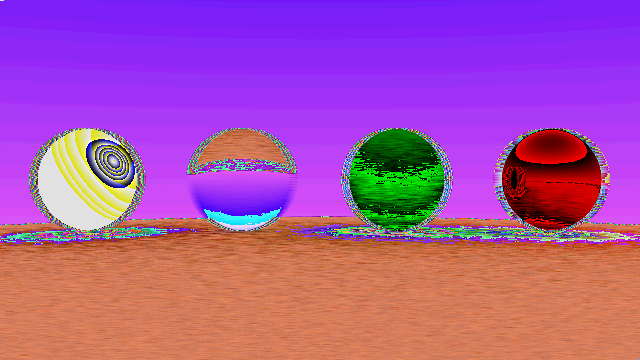

# raytracer

Implements a raytracer based on the book [_Ray Tracing in One Weekend_](https://raytracing.github.io/books/RayTracingInOneWeekend.html). 

## How to build

*Windows*

Open git bash to the directory containing this repository.

```
raytracer $ mkdir build
raytracer $ cd build
raytracer/build $ cmake -G "Visual Studio 16 2019" ..
raytracer/build $ start CS312-Raytracer.sln
```

Your solution file should contain multiple projects, such as `gradient` and `normals`.
To run from the git bash command shell, 

```
raytracer/build $ ../bin/Debug/gradient
raytracer/build $ ../bin/Debug/normals
```

*macOS*

Open terminal to the directory containing this repository.

```
raytracer $ mkdir build
raytracer $ cd build
raytracer/build $ cmake ..
raytracer/build $ make
```

To run each program from build, you would type

```
raytracer/build $ ../bin/gradient
raytracer/build $ ../bin/normals
```

## Results

As my unique feature, I implemented a blur that takes each pixel's components
and adds the surrounding 8 pixels' to it. This creates a mirage of sand, which
I call Oasis: Spheres in the Desert. 

